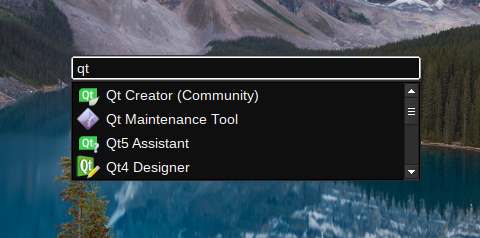

[](https://travis-ci.org/rodlie/qtfm)


Lightweight file manager using Qt.

 * Desktop (theme/applications/mime) integration
 * Customizable interface
 * Powerful custom command system
 * Customizable key bindings
 * Drag & drop functionality
 * Tabs
 * Udisks device support

## Additional applications

QtFM comes bundled with a small selection of additional applications that may enchance your desktop experience.

### qtfm-tray

A system tray daemon that takes care of removable and optical devices.

 * Notify user when a device is added
 * Notify user when a device has been removed
 * Mount/Unmount partitions
 * Eject optical media
 * Open mounted partition in qtfm
 
 This application is still under development.
 
### qtfm-open



A simple application launcher for use in Fluxbox, Openbox and other window managers.

#### Fluxbox

Open ``~/.fluxbox/keys`` and find the line starting with ``Mod1 F2``, replace existing launcher ``fbrun`` with ``qtfm-open``.
```
# open a dialog to run programs
Mod1 F2 :Exec qtfm-open
```

#### Openbox

Open ``~/.config/openbox/rc.xml`` and find the line line ``<!-- Keybindings for running applications -->``. Then add:

```
  <keybind key="A-F2">
    <action name="Execute">
      <command>qtfm-open</command>
    </action>
  </keybind>
```

This application is still under development.

## Packages

QtFM is available in several distributions, check below if your distribution has the latest version:

[](https://repology.org/metapackage/qtfm)

## Links

 * [Releases](https://github.com/rodlie/qtfm/releases)
 * [Milestones](https://github.com/rodlie/qtfm/milestones)
 * [Issues](https://github.com/rodlie/qtfm/issues)
 
## Default shortcuts

| Action                      | Shortcut    |
|:---------------------------:|:-----------:|
| New Window                  | [ctrl+n]    |
| Open Tab                    | [ctrl+t]    |
| Close Tab                   | [ctrl+w]    |
| Copy Action                 | [ctrl+c]    |
| Paste Action                | [ctrl+v]    |
| Up Action                   | [alt+up]    |
| Back Action                 | [backspace] |
| Toggle Show Hidden Files    | [ctrl+h]    |
| Move to Trash               | [del]       |
| Delete                      | [shift+del] |
| Open Terminal               | [F1]        |
| Quit/Close                  | [ctrl+q]    |
| Rename Action               | [F2]        |
| Zoom Out                    | [ctrl+-]    |
| Zoom In                     | [ctrl++]    |
| Focus Path                  | [ctrl+l]    |
| Toogle Icon View            | [F3]        |
| Toogle Detail View          | [F4]        |
| Drag and Drop Move Modifier | [shift]     |
| Drag and Drop Copy Modifier | [ctrl]      |
| Drag and Drop Ask Action    | [alt]       |

All shortcuts can be modified.
 
## Build

Download the latest [release](https://github.com/rodlie/qtfm/releases), then make sure you have the required dependencies.

* Requires [Qt](http://qt.io) 4 or 5 development files.
* Requires [file](http://darwinsys.com/file/) development files **if using Qt 4**.
* Requires [hicolor-icon-theme](https://www.freedesktop.org/wiki/Software/icon-theme/).
* Requires [adwaita-icon-theme](https://github.com/GNOME/adwaita-icon-theme), or [tango-icon-theme](http://tango.freedesktop.org) as a fallback icon theme.
* Optional [udisks](https://www.freedesktop.org/wiki/Software/udisks/) and [upower](https://upower.freedesktop.org/) at run-time.

Download and extract:
```
tar xvf qtfm-VERSION.tar.gz
cd qtfm-VERSION
```

Or use git:
```
git clone https://github.com/rodlie/qtfm
cd qtfm
```

Now you just need to build it:

Optional build options:

 * ``CONFIG+=no_udisks`` : This will disable udisks, note that qtfm-tray will not build with this option enabled.
 * ``CONFIG+=no_tray`` : This will disable qtfm-tray
 * ``CONFIG+=no_open`` : This will disable qtfm-open
 * ``CONFIG+=no_appdock``: This will disable the application dock in QtFM
 * ``CONFIG+=no_dbus`` : This will disable D-Bus features in QtFM
 
 You can disable all additional features with ``CONFIG+=basic``
 
```
mkdir build && cd build
qmake CONFIG+=release ..
make
```

You can run the binary ``fm/qtfm`` or install to ``/usr/local``:
```
sudo make install
```

## Packaging

Same as above, but you should use ``PREFIX=`` and ``INSTALL_ROOT=``.

Example:

```
mkdir build && cd build
qmake CONFIG+=release PREFIX=/usr ..
make -jX
make INSTALL_ROOT=/package_temp_path install
```
```
package
├── etc
│   └── xdg
│       └── autostart
│           └── qtfm-tray.desktop
└── usr
    ├── bin
    │   ├── qtfm
    │   ├── qtfm-open
    │   └── qtfm-tray
    └── share
        ├── applications
        │   └── qtfm.desktop
        └── doc
            └── qtfm-6.1.0
                ├── LICENSE
                └── README.md
```
* You can change the doc location with ``DOCDIR=``, default is ``PREFIX/share/doc``.
* You can change the xdg location with ``XDGDIR=``.

## Related

 * **[powerdwarf](https://github.com/rodlie/powerdwarf)** : Desktop Independent Power Manager.
 * **[Openbox](http://openbox.org/wiki/Main_Page)** : Openbox is a highly configurable, next generation window manager with extensive standards support. 
 * **[tint2](https://gitlab.com/o9000/tint2)** : A lightweight panel/taskbar for Linux and BSD.
 * **[qterminal](https://github.com/lxqt/qterminal)** : A lightweight Qt-based terminal emulator.
 
