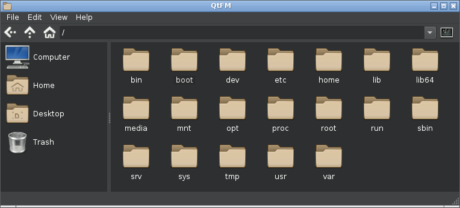

# QtFM 6.2

<p align="left" style="float:right;"></p>

[](https://github.com/rodlie/qtfm/releases)
[](https://github.com/rodlie/qtfm)
[](https://travis-ci.org/rodlie/qtfm)


Lightweight desktop independent Qt file manager for Linux, FreeBSD, NetBSD, OpenBSD and macOS.

  * XDG integration
  * Customizable interface
  * Powerful custom command system
  * Customizable key bindings
  * Drag & drop functionality
  * Tabs support
  * Removable storage support
  * System tray daemon (``qtfm-tray(1)``)
    * Show available storage/optical devices in system tray
    * Auto mount (and open) storage/optical devices when added *(not default)*
    * Auto play CD/DVD *(not default)*
  * Extensive thumbnail support
    * Supports image formats through ``ImageMagick``
    * Supports PDF and related documents
    * Supports video formats through ``FFmpeg``
    * Supports embedded images in media files

## Default shortcuts

| Action                      | Shortcut    |
|:---------------------------:|:-----------:|
| New Window                  | [ctrl+n]    |
| Open Tab                    | [ctrl+t]    |
| Close Tab                   | [ctrl+w]    |
| Copy Action                 | [ctrl+c]    |
| Paste Action                | [ctrl+v]    |
| Up Action                   | [alt+up]    |
| Back Action                 | [backspace] |
| Toggle Show Hidden Files    | [ctrl+h]    |
| Move to Trash               | [del]       |
| Delete                      | [shift+del] |
| Open Terminal               | [F1]        |
| Quit/Close                  | [ctrl+q]    |
| Rename Action               | [F2]        |
| Zoom Out                    | [ctrl+-]    |
| Zoom In                     | [ctrl++]    |
| Focus Path                  | [ctrl+l]    |
| Toggle Icon View            | [F3]        |
| Toggle Detail View          | [F4]        |
| Refresh View                | [F5]        |
| Drag and Drop Move Modifier | [shift]     |
| Drag and Drop Copy Modifier | [ctrl]      |
| Drag and Drop Ask Action    | [alt]       |

All shortcuts can be modified.

## Build

Download the latest [release](https://github.com/rodlie/qtfm/releases), then make sure you have the required dependencies.

* Requires [Qt](http://qt.io) 5.2+ (5.6.3/5.9.7/5.12.x recommended)
  * libQt5Widgets
  * libQt5Gui
  * libQt5Concurrent
  * libQt5DBus
  * libQt5Core
* Requires [hicolor-icon-theme](https://www.freedesktop.org/wiki/Software/icon-theme/)
* Requires [adwaita-icon-theme](https://github.com/GNOME/adwaita-icon-theme) or similar
* Requires [libinotify](https://github.com/libinotify-kqueue/libinotify-kqueue) *if using BSD/macOS*
* Recommended [udisks](https://www.freedesktop.org/wiki/Software/udisks/)/[bsdisks](https://www.freshports.org/sysutils/bsdisks/) at run-time
* Recommended [ImageMagick (Magick++)](http://imagemagick.org) 6.9/7.x for improved thumbnail support
  * libMagick++
  * libMagickWand
  * libMagickCore
* Recommended [FFmpeg](https://ffmpeg.org) 3+ for video/audio thumbnails/coverart
  * libavdevice
  * libswscale
  * libavformat
  * libavcodec
  * libavutil

Download and extract:
```
tar xvf qtfm-6.2.x.tar.gz
cd qtfm-6.2.x
```

Or use git:
```
git clone -b 6.2 https://github.com/rodlie/qtfm
cd qtfm
```

Build options:

 * ``CONFIG+=with_magick`` : This will enable ``ImageMagick`` support.
   * ``MAGICK_PC=`` : Custom ``Magick++`` pkg-config .pc file.
   * ``CONFIG+=magick7`` : Use ``ImageMagick`` v7+.
   * ``CONFIG+=oldmagick`` : If you have ``ImageMagick`` older than 6.9 *(Ubuntu)*.
 * ``CONFIG+=with_ffmpeg`` : This will enable FFmpeg support *(**NOTE!** requires ImageMagick)*.
 * ``CONFIG+=no_tray`` : This will disable ``qtfm-tray`` (``no_dbus`` will also disable this feature).
 * ``CONFIG+=no_dbus`` : This will disable D-Bus session and ``udisks`` features in (lib)QtFM, ``qtfm-tray`` will also not be built.
 * ``CONFIG+=with_includes`` : Install library includes and pkg-config
 * ``CONFIG+=sharedlib`` : Force shared library.
 * ``PREFIX=`` : Install prefix, where things are installed when running ``make install``
 * ``DOCDIR=`` : Location for documentation (default is ``PREFIX/share/doc``)
 * ``MANDIR=`` : Location for man pages (default is ``PREFIX/share/man``)
 * ``XDGDIR=`` : Location of XDG (default is ``/etc/xdg`` or ``PREFIX/etc/xdg``)
 * ``LIBDIR=`` : Library location (default is ``$PREFIX/lib$LIBSUFFIX``), only used if shared library is enabled

Doing a normal build:
```
mkdir build && cd build
qmake ..
make
```

You can run the binary ``bin/qtfm`` or install to ``/usr/local``:
```
sudo make install
```

## Packaging

Same as above, but you should use ``PREFIX=`` and ``INSTALL_ROOT=``.

Example:

```
mkdir build && cd build
qmake PREFIX=/usr CONFIG+=with_magick CONFIG+=with_ffmpeg ..
make -jX
make INSTALL_ROOT=/package_temp_path install
```

## License

QtFM is licensed under the GPL-2.0 License.

## Related

 * **[powerkit](https://github.com/rodlie/powerkit)** : Desktop Independent Power Manager.
 * **[Openbox](http://openbox.org/wiki/Main_Page)** : Openbox is a highly configurable, next generation window manager with extensive standards support.
